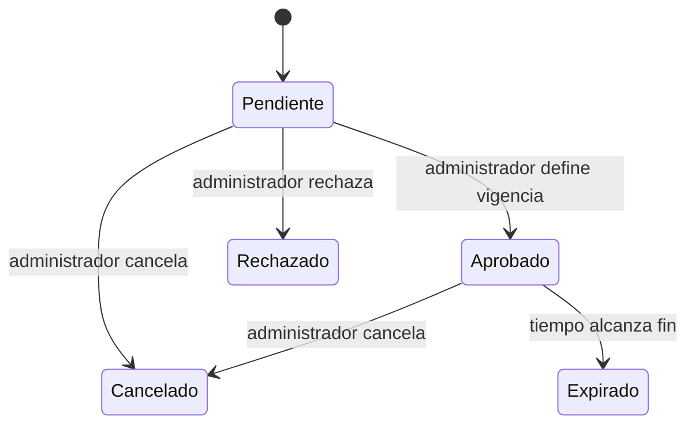

# Procesos y estados

## CU-01 · Consultar lugar

Visitante abre directorio → solicita categorías/lugares → API filtra activos → aplicación presenta lista → selecciona lugar → detalle muestra contactos, horarios y coordenadas → mapa sitúa el lugar. Sin GPS se conserva consulta y mapa; cercanía no es un requisito previo.

Errores: fallo de red con reintento; colección vacía con mensaje; lugar inactivo con 404. No mostrar información inventada cuando faltan horarios.

## CU-02 · Publicar mensaje

Actor autenticado activo elige foro → escribe → envía → servidor verifica identidad, foro, frecuencia y contenido → guarda autor desde sesión → devuelve 201 → pantalla incorpora mensaje. El cliente nunca elige un autor ajeno.

Errores: 401 sesión inválida; 403 usuario inactivo; 422 contenido; 429 frecuencia. El formulario conserva texto ante error de red. No hacer reintentos automáticos de POST sin una estrategia de duplicados.

## CU-03 · Destacar mensaje

Autor solicita sobre mensaje propio activo → solicitud pendiente → administrador revisa → rechaza o aprueba con fechas → API determina vigencia → al vencer se presenta como mensaje normal. Cancelación y moderación eliminan prioridad.

Expirado es estado efectivo derivado de fechas. Aprobado puede estar programado y aún no vigente. Transiciones se validan en servidor y transacción.

## CU-04 · Administrar

Administrador autenticado valida datos → modifica categoría/lugar/horario o visibilidad de mensaje → servidor autoriza → guarda → se refleja en lectura pública. Desactivar antes que borrar físicamente.

## Estados Flutter

Lectura: inicial → cargando → datos/vacío/error; reintento vuelve a cargando.
Formulario: edición → enviando → éxito/error. Impedir envíos repetidos mientras está enviando.
