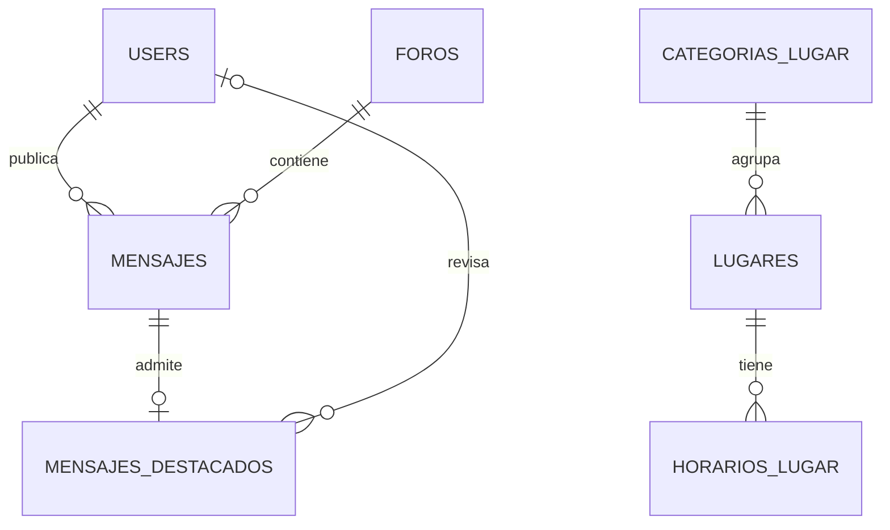

# Modelo relacional candidato

| Tabla | Propósito | Restricciones centrales |
|---|---|---|
| users | Identidad y permiso | username único sin diferencias de caso, contacto no vacío, role user/admin |
| categorias_lugar | Clasificación | nombre único y activo |
| lugares | Información local | FK categoría, coordenadas obligatorias/rango |
| horarios_lugar | Intervalos semanales | FK lugar, día 1–7, intervalos nocturnos explícitos |
| foros | Cuatro espacios | posición única 1–4 |
| mensajes | Contenido comunitario | FK foro y autor, texto no vacío, activo |
| mensajes_destacados | Solicitud y vigencia | mensaje único, estado, tipo, fechas y revisor |

## Corrección y límites

El SQL `03-esquema-candidato.sql` es un documento de diseño; no fue ejecutado. Las migraciones Laravel serán la fuente del esquema instalado. No usar ambos mecanismos de creación sobre la misma base.

Unicidad de mensaje destacado concreta el DER 1:0..1. Si se requieren múltiples períodos o renovaciones, acordar 1:N e historial antes de programar ese módulo.

Cuatro posiciones impiden un quinto foro; CHECK no garantiza cuatro filas existentes. Seed transaccional y validación de configuración deberán garantizar exactamente cuatro, sin CRUD de alta/baja público.

Solapamiento de horarios se valida por servicio y prueba de concurrencia al implementarlo. Las marcas created_at/updated_at deberán ser mantenidas por Eloquent. Los instantes se almacenan como timestamptz; horarios semanales se interpretan en America/Santiago.

El SQL no incluye las tablas técnicas que pueda necesitar Laravel. Su inclusión dependerá de la configuración real al inicializarlo.
